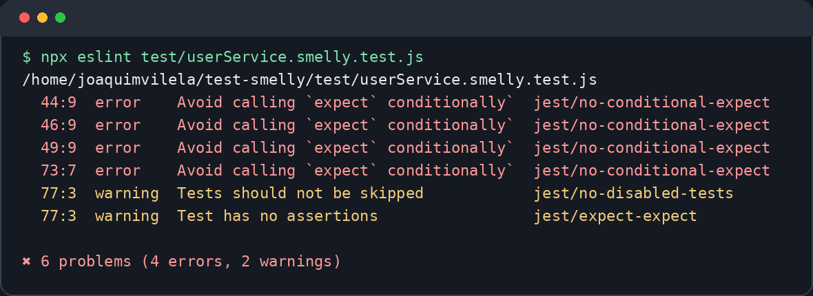
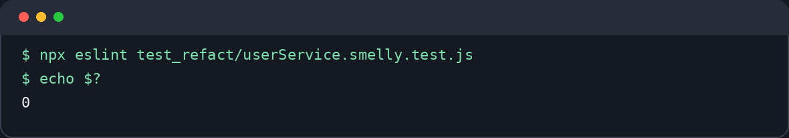
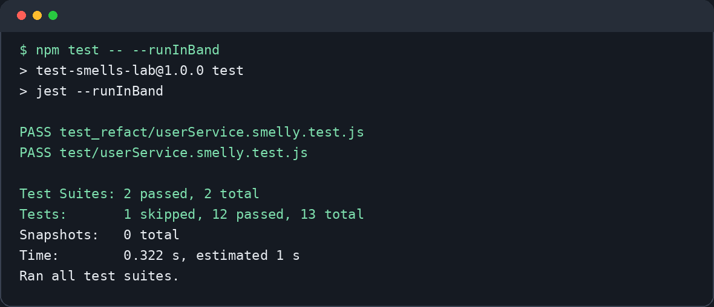

# Refatoração de Testes e Detecção de Test Smells

**Disciplina:** Teste de Software  
**Trabalho:** Refatoração de Testes e Detecção de Test Smells  
**Aluno:** Joaquim Guilherme de Carvalho Vilela Silva  
**Matrícula:** 850590  
**Data:** 6 de outubro de 2026

## 1. Análise dos Test Smells

Eu analisei a suíte original em `test/userService.smelly.test.js`. Os testes passam, mas encontrei problemas que podem fazer um erro passar despercebido ou dificultar mudanças no código.

### 1.1 Lógica condicional dentro do teste

O teste de desativação usa um `for` para percorrer dois usuários e um `if` para escolher quais verificações serão feitas. Isso é um mau cheiro porque o teste fica com mais de um caminho possível. Para entender o resultado, preciso acompanhar o laço e a condição. O risco é uma verificação não ser executada em algum caminho e o teste passar mesmo com um defeito.

### 1.2 Exceção que pode não ser testada

No teste do usuário menor de idade, a chamada está dentro de um `try/catch`, mas o `expect` fica só no `catch`. Se a função deixar de lançar a exceção, o `catch` não será executado e o teste ainda passará. Esse é um falso positivo: a regra de idade pode estar quebrada sem que o teste avise.

### 1.3 Teste frágil do relatório

O teste do relatório compara uma linha com `ID`, nome, status, pontuação, espaços e quebra de linha. Ele também exige que o relatório comece com um cabeçalho exato. Isso é frágil porque uma pequena mudança na apresentação, como trocar um espaço, pode quebrar o teste mesmo que os dados continuem corretos. O risco é gastar tempo corrigindo testes por mudanças apenas visuais.

## 2. Processo de refatoração

Escolhi o teste do usuário menor de idade porque ele podia passar mesmo quando a validação falhasse. Abaixo estão os trechos dos arquivos original e refatorado.

**Antes — `test/userService.smelly.test.js`:**

```js
test('deve falhar ao criar usuário menor de idade', () => {
  // Este teste não falha se a exceção NÃO for lançada.
  // Ele só passa se o `catch` for executado. Se a lógica de validação
  // for removida, o teste passa silenciosamente, escondendo um bug.
  try {
    userService.createUser('Menor', 'menor@email.com', 17);
  } catch (e) {
    expect(e.message).toBe('O usuário deve ser maior de idade.');
  }
});
```

**Depois — `test_refact/userService.smelly.test.js`:**

```js
test('deve falhar ao criar usuário menor de idade', () => {
  // Arrange
  const idade = 17;

  // Act
  const criarUsuarioMenor = () => userService.createUser('Menor', 'menor@email.com', idade);

  // Assert: o teste falha se a exceção NÃO for lançada.
  // Sem try/catch, a ausência da validação não passa silenciosamente.
  expect(criarUsuarioMenor).toThrow();
});
```

Eu usei o padrão **Arrange, Act, Assert (AAA)** para deixar claro o preparo, a ação e a verificação. O `toThrow()` exige que a exceção aconteça. Também deixei de comparar a mensagem exata do erro, pois o comportamento importante aqui é rejeitar a idade inválida.

Nos outros testes, separei a criação da busca e o usuário comum do administrador. Assim cada teste verifica um comportamento, sem `for` ou `if`. No relatório, passei a conferir as informações presentes sem exigir a linha inteira formatada. Também implementei o caso que estava marcado com `test.skip`.

## 3. Relatório da ferramenta

Este é o resultado da primeira análise do arquivo original depois de configurar o ESLint:



O ESLint apontou **4 erros** de `jest/no-conditional-expect`: três no teste com `for` e `if` e um no `try/catch`. Ele também mostrou **2 avisos** no teste ignorado: `jest/no-disabled-tests` e `jest/expect-expect`. A ferramenta ajudou a encontrar esses pontos rapidamente e indicou as linhas. A comparação rígida do relatório foi identificada na leitura manual do código.

**Depois da refatoração:**



O comando `npx eslint test_refact/userService.smelly.test.js` não mostrou erros ou avisos; o código de saída `0` confirma que terminou com sucesso. `npm test` também passou: **12 testes aprovados e 1 ignorado**, sendo o ignorado apenas da suíte original. O comando `npx eslint .` ainda aponta problemas no arquivo original, que foi mantido para comparação.

## 4. Conclusão

Aprendi que um teste passar não quer dizer que ele seja bom. Um teste claro e focado ajuda a perceber quando uma regra do programa quebra e facilita futuras mudanças. O ESLint ajuda a encontrar problemas repetitivos, enquanto a leitura do código ajuda a perceber testes frágeis que a ferramenta não mostrou. Usar os dois torna a manutenção do projeto mais simples.

## 5. Resultado final dos testes

